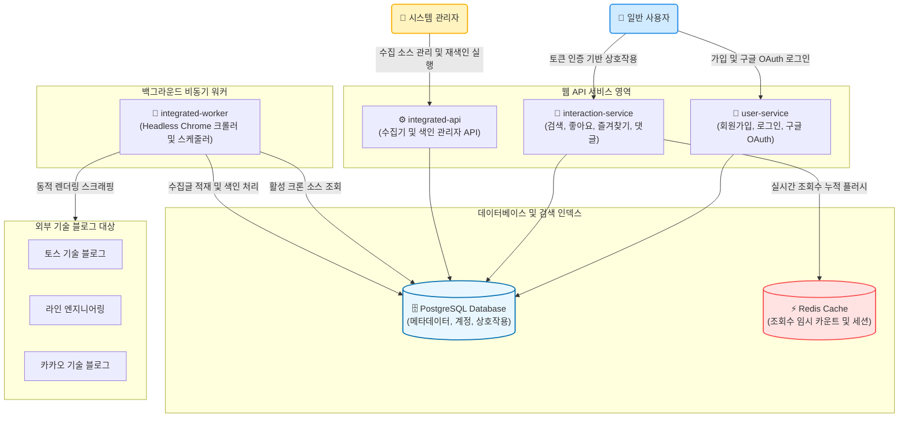

# 블로그 수집기 시스템 API & 아키텍처 문서

이 문서 허브는 **블로그 수집기 시스템(Blog Collector System)**의 시스템 구성도, 공통 인증 및 페이징 가이드, 서비스별 API 명세 목록을 한눈에 볼 수 있도록 구성되어 있습니다.

---

## 1. 시스템 아키텍처 구성도

아래는 사용자 서비스, 상호작용 서비스, 관리자 API, 그리고 백그라운드 크롤링 워커가 데이터베이스 및 외부 사이트와 어떻게 연동하여 블로그 게시글을 수집하고 색인하는지 보여주는 구성도입니다.



---

## 2. 서비스별 상세 명세서 목록

하단의 링크를 통해 각 백엔드 서비스의 상세 기능 및 API 규격을 확인할 수 있습니다.

1. [🔑 회원 및 인증 서비스 명세서 (user-service)](file:///Users/cycy/Desktop/github/backend/docs/user-service.md)
   - 자체 패스워드 로그인 및 구글 OAuth 소셜 로그인 콜백 규격.
   - 내 프로필 조회, 정보 변경, 회원탈퇴 및 계정 통합 API.
2. [💬 포스팅 및 사용자 상호작용 서비스 명세서 (interaction-service)](file:///Users/cycy/Desktop/github/backend/docs/interaction-service.md)
   - 기술 블로그 목록 검색 및 상세 조회 (현재 로그인 사용자의 좋아요/북마크 상태 연동).
   - 좋아요, 즐겨찾기, 2단계 댓글 및 대댓글(답글), 악성/만료 콘텐츠 신고 API.
3. [⚙️ 관리자 및 수집/색인 제어 API 명세서 (integrated-api)](file:///Users/cycy/Desktop/github/backend/docs/integrated-api.md)
   - 블로그 제공자(Toss, Line 등) 및 크롤링 대상 소스 관리 기능.
   - 수집 작업 수동 구동, 재색인(Reindexing) 작업 트리거 및 진행상태 모니터링 API.
4. [🤖 백그라운드 스케줄러 아키텍처 가이드 (integrated-worker)](file:///Users/cycy/Desktop/github/backend/docs/integrated-worker.md)
   - Spring `@Scheduled` 크론 주기 엔진 및 대기열 처리 프로세스 흐름 설명.
   - Selenium Headless Chrome 브라우저 기동 및 JS 렌더링 대기 동적 크롤링 메커니즘.

---

## 3. 공통 API 디자인 가이드

### 3.1 회원 인증 (Authorization)
인증이 필요한 모든 API를 호출할 때는 HTTP 요청 헤더에 발급된 JWT 토큰을 Bearer 타입으로 포함시켜 전송해야 합니다:
```http
Authorization: Bearer <your_jwt_access_token>
```
*JWT 액세스 토큰은 [user-service](file:///Users/cycy/Desktop/github/backend/docs/user-service.md)의 로그인 혹은 구글 OAuth 콜백 API를 통해 발급됩니다.*

### 3.2 공통 페이징 응답 규격 (Pagination)
시스템 내 목록 조회 API는 Spring Data의 `Pageable` 스펙(0번 페이지부터 시작)을 따르며, 공통으로 `OffsetPageResult` 형태의 래퍼 구조로 데이터를 반환합니다.

```json
{
  "total_count": 95,
  "page": 0,
  "size": 20,
  "items": [ ... ]
}
```
