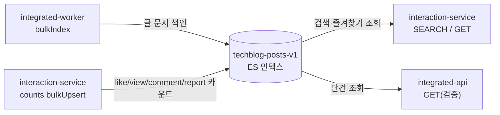

# Elasticsearch 구성 및 사용 가이드

이 문서는 블로그 수집기 시스템에서 **Elasticsearch(이하 ES)** 를 어떻게 로컬용/운영용으로 설정하고, 각 서비스 모듈이 ES를 어떤 방식으로 사용하는지 정리한 가이드입니다.

ES 인프라 코드는 **`common-elasticsearch`** 공통 모듈에 모여 있고, 이를 필요로 하는 서비스가 `implementation project(":common-elasticsearch")` 로 가져다 씁니다.

| 서비스 | ES 사용 | 역할 |
|--------|:------:|------|
| `integrated-worker` | O | 크롤링된 글을 인덱스에 색인(bulk index) |
| `integrated-api` | O | 색인 문서 단건 조회(재색인/정합성 검증) |
| `interaction-service` | O | 글 검색 / 즐겨찾기 조회 / 카운트 upsert |
| `user-service` | X | 미사용 |

- **ES 버전**: `8.18.0` (`common-elasticsearch/build.gradle` 의 `elasticsearchVersion`)
- **클라이언트**: 공식 Java 클라이언트 `co.elastic.clients:elasticsearch-java` (Low-level `RestClient` 기반)
- **인덱스명**: `techblog-posts-v1` (`elasticsearch.index-name`, `ES_INDEX_NAME` 로 오버라이드)
- **형태소 분석**: 한글 분석기 **Nori** (`analysis-nori` 플러그인)

---

## 1. 구조 개요

```
common-elasticsearch/
  src/main/java/com/backend/commonelasticsearch/
    config/
      ElasticsearchConfig.java              # RestClient / Transport / ElasticsearchClient Bean
      ElasticsearchProperties.java          # @ConfigurationProperties(prefix="elasticsearch")
    client/
      ApplicationElasticsearchClient.java           # ES 호출 래퍼(예외 변환 적용)
      ApplicationElasticsearchClientCallback.java   # 함수형 콜백 인터페이스
    operation/
      ElasticsearchOperation.java           # GET / SEARCH / BULK (로그·변환 컨텍스트)
      bulk/
        ElasticsearchBulkOperations.java    # bulkIndex / bulkUpdate 헬퍼
        BulkOperationResult.java            # 실패 ID·성공 건수 집계
    exception/
      ElasticsearchExceptionTranslator.java # ES 예외 → BusinessException 변환
  src/main/resources/
    application-elasticsearch-defaults.yml   # 로컬/운영 접속값(프로파일 분기)

docker-backend/
  docker-compose.yml                         # 로컬 ES 컨테이너 정의
  elasticsearch/Dockerfile                   # ES 8.18.0 + Nori 플러그인

각 Boot 서비스/
  build.gradle                               # implementation project(":common-elasticsearch")
  application.yml                            # spring.config.import 로 defaults 로드
```

| 파일 | 역할 |
|------|------|
| `application-elasticsearch-defaults.yml` | host/port/scheme/auth/index-name **값** (local·prod) |
| `ElasticsearchConfig.java` | yml 값을 읽어 클라이언트 Bean 구성(Auth/TLS) |
| 서비스 `application.yml` | `spring.config.import` 로 defaults 로드, 필요 시 override |

### 왜 공통 모듈 + yml 중심인가

접속 설정을 각 서비스에 흩어두지 않고 `common-elasticsearch` 한 곳에서 프로파일로 분기합니다. 서비스는 defaults 를 **import 만** 하고 개별 접속값을 갖지 않으므로, 접속 정책 변경이 한 파일로 끝납니다.

---

## 2. 서비스 연결

```gradle
implementation project(":common-elasticsearch")
```

```yaml
spring:
  config:
    import: >-
      optional:classpath:application-logging-defaults.yml,
      optional:classpath:application-elasticsearch-defaults.yml
```

서비스는 접속값(`elasticsearch.*`)을 자체 `application.yml` 에 두지 않고 defaults 에서 상속합니다.

---

## 3. 로컬용 / 운영용 설정

접속 설정은 전부 `common-elasticsearch/src/main/resources/application-elasticsearch-defaults.yml` **한 파일**에서 프로파일로 분기됩니다.

### 3.1 기본(로컬) — 보안 꺼진 컨테이너에 평문 http

```yaml
# 기본 문서 = 로컬(옵션 A): 보안 꺼진 컨테이너에 평문 http 접속
elasticsearch:
  host: ${ES_HOST:localhost}
  port: ${ES_PORT:9200}
  scheme: ${ES_SCHEME:http}
  username: ${ES_USERNAME:}
  password: ${ES_PASSWORD:}
  fingerprint: ${ES_FINGERPRINT:}
  index-name: ${ES_INDEX_NAME:techblog-posts-v1}
```

- 인증 없이(`username` 공백) `http://localhost:9200` 접속.
- 모든 값에 기본값이 있어 **환경변수 없이도 로컬에서 바로 기동**됩니다.

### 3.2 `prod` 프로필(운영) — https + 인증 + CA fingerprint

```yaml
# prod 프로필 = 운영(옵션 C): https + 인증 + CA fingerprint 검증
# 시크릿은 기본값 없이 → 미주입 시 기동 실패하도록(누락 방지)
spring:
  config:
    activate:
      on-profile: prod

elasticsearch:
  host: ${ES_HOST}
  port: ${ES_PORT:9200}
  scheme: https
  username: ${ES_USERNAME:elastic}
  password: ${ES_PASSWORD}
  fingerprint: ${ES_FINGERPRINT}
```

- `host` / `password` / `fingerprint` 는 **기본값이 없어**, 미주입 시 기동이 실패합니다(운영 시크릿 누락 방지 의도).
- `scheme: https` 고정.

### 3.3 환경변수 요약

| 변수 | 로컬 기본값 | 운영(prod) |
|------|------------|-----------|
| `ES_HOST` | `localhost` | **필수** |
| `ES_PORT` | `9200` | `9200` |
| `ES_SCHEME` | `http` | `https` (고정) |
| `ES_USERNAME` | 공백(인증 X) | `elastic` |
| `ES_PASSWORD` | 공백 | **필수** |
| `ES_FINGERPRINT` | 공백 | **필수(CA 지문 검증)** |
| `ES_INDEX_NAME` | `techblog-posts-v1` | 동일 |

### 3.4 프로퍼티 → 클라이언트 매핑

`ElasticsearchConfig` 가 위 값을 읽어 `RestClient → Transport → ElasticsearchClient` Bean 체인을 만듭니다.

- `username` 이 비어있지 않을 때만 Basic Auth 적용 → 로컬은 인증 생략, 운영은 자동 적용.
- `scheme=https` + `fingerprint` 존재 시 `TransportUtils.sslContextFromCaFingerprint(...)` 로 TLS 검증.
- `ObjectMapper` 에 `JavaTimeModule` 등록 + 날짜를 timestamp 가 아닌 ISO 문자열로 직렬화(`WRITE_DATES_AS_TIMESTAMPS=false`).

```26:48:common-elasticsearch/src/main/java/com/backend/commonelasticsearch/config/ElasticsearchConfig.java
    public RestClient restClient(ElasticsearchProperties props) {
        HttpHost httpHost = new HttpHost(props.host(), props.port(), props.scheme());

        return RestClient.builder(httpHost)
                         .setHttpClientConfigCallback(httpClientBuilder -> {
                             // basic auth
                             if (props.username() != null && !props.username().isBlank()) {
                                 ...
                             }
                             // TLS: CA fingerprint 검증
                             if ("https".equalsIgnoreCase(props.scheme())
                                     && props.fingerprint() != null && !props.fingerprint().isBlank()) {
                                 ...
                             }
```

---

## 4. 로컬 실행 환경 (Docker)

로컬 ES 는 `docker-backend/docker-compose.yml` 의 `elasticsearch` 서비스로 띄웁니다. 공식 이미지가 아닌 **커스텀 `Dockerfile`** 을 빌드해 한글 형태소 분석기 **Nori 플러그인**을 설치합니다.

```dockerfile
FROM docker.elastic.co/elasticsearch/elasticsearch:8.18.0
RUN elasticsearch-plugin install --batch analysis-nori
```

컨테이너 핵심 설정:

| 항목 | 값 | 의미 |
|------|-----|------|
| `discovery.type` | `single-node` | 단일 노드 |
| `xpack.security.enabled` | `false` | 로컬 평문 http 와 일치 |
| `ES_JAVA_OPTS` | `-Xms1g -Xmx2g` | 힙 크기 |
| ports | `9200:9200` | REST 포트 |
| volumes | `elasticsearch_data` | 데이터 영속화 |

> 로컬 = compose 로 보안 끈 단일 노드 + Nori, 운영 = https/인증/지문 검증 으로 대칭 구성입니다.
> (Kibana 서비스는 compose 에 주석 처리되어 기본 비활성.)

```bash
# 로컬 인프라 기동
cd docker-backend && docker compose up -d elasticsearch

# 상태 확인
curl -fsS http://localhost:9200
```

---

## 5. 애플리케이션 사용 패턴

### 5.1 공통 호출 규약 — `ApplicationElasticsearchClient`

모든 ES 호출은 원시 `ElasticsearchClient` 를 직접 쓰지 않고 이 래퍼의 `execute(operation, callback)` 를 통해 실행합니다. 콜백에서 발생한 예외는 `ElasticsearchExceptionTranslator` 로 자동 변환됩니다.

```20:28:common-elasticsearch/src/main/java/com/backend/commonelasticsearch/client/ApplicationElasticsearchClient.java
    public <T> T execute(ElasticsearchOperation operation, ApplicationElasticsearchClientCallback<T> callback) {
        try {
            return callback.execute(elasticsearchClient);
        } catch (BusinessException e) {
            throw e;
        } catch (Exception e) {
            throw ElasticsearchExceptionTranslator.translate(operation, e);
        }
    }
```

**예외 변환 정책** (`ElasticsearchExceptionTranslator`):

| 원인 | 변환 결과 |
|------|-----------|
| 통신 장애(`IOException`), 클러스터 장애, 5xx, 인프라성 에러 타입 | `InfraException` (500) |
| 요청 데이터/쿼리/매핑 오류, 4xx, 클라이언트성 에러 타입 | `BadRequestException` (400) |

에러 타입은 화이트리스트(`INFRA_ERROR_TYPES`, `CLIENT_ERROR_TYPES`)로 분류합니다.

### 5.2 Bulk 헬퍼 — `ElasticsearchBulkOperations`

색인/업서트를 담당하는 Repository 는 이 헬퍼를 인스턴스로 생성해 사용합니다.

- `bulkIndex(documents, idExtractor)` : 문서 전체 색인(index)
- `bulkUpdate(sources, idExtractor, docMapper, docAsUpsert)` : 부분 필드 병합(update, `doc_as_upsert` 지원)
- 결과는 `BulkOperationResult`(실패 ID 집합 + 성공 건수)로 반환.

### 5.3 서비스별 사용 현황

| 서비스 | Repository | Operation | 용도 |
|--------|-----------|:---------:|------|
| `integrated-worker` | `PostElasticsearchRepository` | **BULK (index)** | 크롤링 글(`EsPostDocument`)을 인덱스에 색인 |
| `integrated-api` | `IndexedPostElasticsearchRepository` | **GET** | 색인 문서 단건 조회(재색인/정합성 검증) |
| `interaction-service` | `PostDocumentElasticsearchRepository` | **GET / SEARCH** | 글 검색(bool: status filter + provider filter + title match, `publishedAt` desc, offset paging) |
| `interaction-service` | `PostBookmarkElasticsearchRepository` | **SEARCH (ids)** | 즐겨찾기 post_id 목록을 순서 유지하며 bulk 조회 |
| `interaction-service` | `PostCountsElasticsearchRepository` | **BULK (update/upsert)** | posts 카운트 필드를 인덱스에 주기적 부분 upsert |

**공통 규칙**
- 인덱스명은 모든 Repository 가 `@Value("${elasticsearch.index-name}")` 로 주입 (하드코딩 없음).
- 문서 ID 는 항상 도메인 엔티티의 `UUID.toString()` → 서비스 간 문서 정합성 유지.

### 5.4 데이터 흐름



---

## 6. 관련 파일

| 경로 | 역할 |
|------|------|
| `common-elasticsearch/src/main/resources/application-elasticsearch-defaults.yml` | 로컬/운영 접속값(프로파일 분기) |
| `common-elasticsearch/.../config/ElasticsearchConfig.java` | 클라이언트 Bean 구성(Auth/TLS) |
| `common-elasticsearch/.../config/ElasticsearchProperties.java` | `elasticsearch.*` 바인딩 |
| `common-elasticsearch/.../client/ApplicationElasticsearchClient.java` | 호출 래퍼 + 예외 변환 |
| `common-elasticsearch/.../operation/bulk/ElasticsearchBulkOperations.java` | bulk index/update |
| `common-elasticsearch/.../exception/ElasticsearchExceptionTranslator.java` | ES 예외 → BusinessException |
| `docker-backend/docker-compose.yml`, `docker-backend/elasticsearch/Dockerfile` | 로컬 ES 컨테이너(+Nori) |
| `integrated-worker/.../indexingjob/repository/PostElasticsearchRepository.java` | 글 색인(bulk index) |
| `integrated-api/.../indexedpost/repository/IndexedPostElasticsearchRepository.java` | 색인 문서 단건 조회 |
| `interaction-service/.../post/repository/PostDocumentElasticsearchRepository.java` | 검색/단건 조회 |
| `interaction-service/.../post/repository/PostCountsElasticsearchRepository.java` | 카운트 부분 upsert |
| `interaction-service/.../postbookmark/repository/PostBookmarkElasticsearchRepository.java` | 즐겨찾기 bulk 조회 |
