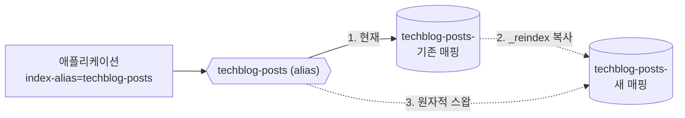

# Elasticsearch 인덱스 관리 가이드 (alias · 버전 · 재색인)

이 문서는 검색 인덱스의 **매핑 형상 관리 + alias 기반 버전 관리 + 재색인/부트스트랩** 운영 방식을 정리합니다.
접속 설정·모듈별 사용 패턴 등 기본 구성은 [elasticsearch-configuration.md](./elasticsearch-configuration.md) 를 참고하세요.

## 핵심 개념

| 개념 | 값/규칙 | 설명 |
|------|---------|------|
| **alias** | `techblog-posts` | 애플리케이션이 읽고/쓰는 유일한 이름(`elasticsearch.index-alias`) |
| **물리 인덱스** | `techblog-posts-<yyMMddHHmmss>` | 프로비저너가 생성하는 실제 인덱스(예: `techblog-posts-260806142530`) |
| **매핑 정의** | `techblog-posts.json` | 리포지토리에 커밋된 단일 소스(형상 관리) |

> 애플리케이션은 **물리 인덱스명을 몰라도** 되고 alias 만 바라봅니다. 매핑을 바꿀 때는 새 물리 인덱스를 만들어 재색인한 뒤 alias 를 원자적으로 스왑하므로, **앱 재배포·다운타임 없이** 스키마를 교체할 수 있습니다.

---

## 1. 3가지 관리 축

### 축1 — 매핑을 파일로 커밋 (Single Source of Truth)

매핑/세팅 정의를 코드 리포지토리에 두어 변경 이력을 git 으로 추적하고, 로컬/운영/스크립트가 **같은 파일**을 참조합니다.

```
common-elasticsearch/src/main/resources/elasticsearch/
  techblog-posts.json              # settings + mappings
  techblog-user-dictionary.txt     # Nori 사용자 사전(회사명·기술 용어)
  techblog-synonyms.txt            # 검색용 동의어(영문/한글/약어)
```

- `techblog-posts.json` 은 `settings`(shards, analysis) + `mappings` 를 담는다.
- 사용자 사전/동의어는 JSON 인라인이 아니라 **별도 텍스트 파일**로 관리한다. 프로비저너·운영 스크립트가 생성 직전에 JSON의 `*_file` 참조를 배열로 치환한다.
- `title` / `summary` 는 색인용 `tech_blog_analyzer` 와 검색용 `tech_blog_search_analyzer`(동의어 포함)를 분리한다.
- `number_of_replicas` 값은 파일에도 있지만, **자동 부트스트랩 경로에서는 환경 설정값으로 덮어씁니다**(아래 3장).

### 축2 — alias 로 참조 + 물리명 timestamp

- 앱 설정 키는 `elasticsearch.index-alias`(= alias `techblog-posts`).
- 모든 Repository 는 `@Value("${elasticsearch.index-alias}")` 로 alias 를 주입받아 index/search/bulk 를 수행합니다. write alias(단일 물리 인덱스, `is_write_index=true`)라 색인/업서트도 정상 동작합니다.
- 물리 인덱스명은 프로비저너가 `alias + "-" + yyMMddHHmmss` 로 생성 → 재색인마다 유일하고 시각 추적이 쉽습니다.

### 축3 — 운영은 명시적 생성/재색인, 로컬만 자동 부트스트랩

| 환경 | 인덱스 생성 방식 |
|------|------------------|
| 로컬 | `integrated-api` 기동 시 자동 부트스트랩(alias 없으면 생성) |
| 운영(prod) | 관리자 API 또는 운영 스크립트로 **명시적** 생성·재색인(자동 부트스트랩 비활성) |

---

## 2. 프로비저너 동작

핵심 로직은 `ElasticsearchIndexProvisioner`(common-elasticsearch)에 있으며, 모든 ES 호출은 `ApplicationElasticsearchClient` 로 감싸 예외 변환을 일관 적용합니다.

| 메서드 | 동작 |
|--------|------|
| `bootstrapIfAbsent()` | alias 없으면 물리 인덱스 생성 + write alias 연결(idempotent) |
| `reindexToNewIndex()` | 새 물리 인덱스 생성 → `_reindex` → alias **원자적 스왑** |
| `currentIndex()` | alias 가 가리키는 현재 물리 인덱스 조회 |

### 재색인 + 스왑 흐름



1. `techblog-posts.json` 매핑 수정 후 커밋
2. 재색인 트리거(API 또는 스크립트)
3. 새 `techblog-posts-<timestamp>` 생성 → `_reindex` → alias 를 remove+add 로 **한 번에** 스왑
4. 이전 인덱스는 삭제하지 않고 남겨 롤백/검증에 활용(검증 후 수동 삭제)

> **재색인 중 유입 데이터 gap**: `_reindex` 시작~alias 스왑 사이에 워커가 새로 색인한 글은 새 인덱스에 누락될 수 있습니다. 다만 `integrated-worker` 의 `IndexingReconciliationWorker`(DB↔ES 정합성 조율)가 주기적으로 누락분을 재색인해 메꾸므로 실질 안전망이 존재합니다. 재색인 직후에는 이 조율기가 한 바퀴 돌아 정합성이 맞춰졌는지 확인하는 것을 권장합니다.

---

## 3. 설정 (application-elasticsearch-defaults.yml)

```yaml
elasticsearch:
  index-alias: ${ES_INDEX_ALIAS:techblog-posts}   # 앱이 읽고/쓰는 alias
  provisioning:
    enabled: ${ES_PROVISIONING_ENABLED:true}       # 자동 부트스트랩(로컬 true / prod false)
    definition-location: ${ES_INDEX_DEFINITION:classpath:elasticsearch/techblog-posts.json}
    number-of-replicas: ${ES_NUMBER_OF_REPLICAS:0} # 로컬 0(green) / prod 1
```

| 키 | 로컬 기본값 | 운영(prod) |
|----|------------|-----------|
| `elasticsearch.index-alias` | `techblog-posts` | `techblog-posts` |
| `elasticsearch.provisioning.enabled` | `true` | `false` |
| `elasticsearch.provisioning.definition-location` | `classpath:elasticsearch/techblog-posts.json` | 동일 |
| `elasticsearch.provisioning.number-of-replicas` | `0` | `1` |

> **replicas 주의**: 로컬 단일 노드는 복제본 배치 노드가 없어 `1` 이면 인덱스가 yellow 로 남습니다. 그래서 로컬은 `0`(green), 운영은 `1` 이상을 권장합니다.

---

## 4. 자동 부트스트랩 (로컬, integrated-api 전용)

`ElasticsearchAutoBootstrapRunner` 는 `@ConditionalOnProperty(elasticsearch.provisioning.enabled=true)` 로 동작하며, **`integrated-api` 에만 존재**합니다.

- 여러 서비스를 동시에 기동해도 인덱스가 중복 생성되는 경쟁을 방지하기 위해 부트스트랩 소유 서비스를 한 곳으로 고정했습니다.
- `integrated-worker` / `interaction-service` 는 자동 부트스트랩을 수행하지 않습니다(러너 없음).
- ES 미기동 등으로 실패해도 예외를 삼켜 애플리케이션 기동을 막지 않습니다.
- 운영(prod)은 `enabled=false` 라 자동 생성되지 않습니다 → 5·6장의 명시적 방법 사용.

---

## 5. 관리자 API (integrated-api)

`ElasticsearchIndexAdminController` — 경로 `/index/v1/elasticsearch`, **ADMIN 권한 필요**(`/index/v1/**` → `hasRole(ADMIN)`).

| 메서드 | 경로 | 설명 |
|--------|------|------|
| `GET` | `/index/v1/elasticsearch/status` | alias → 현재 물리 인덱스 조회 |
| `POST` | `/index/v1/elasticsearch/_bootstrap` | alias 없으면 물리 인덱스 + alias 생성 |
| `POST` | `/index/v1/elasticsearch/_reindex` | 새 인덱스 생성 → 재색인 → alias 스왑 |

응답 예시(`_reindex`, snake_case):

```json
{
  "alias": "techblog-posts",
  "source_index": "techblog-posts-260806142530",
  "new_index": "techblog-posts-260810091500",
  "documents": 1234
}
```

---

## 6. 운영 스크립트 (curl 기반)

```
docker-backend/elasticsearch/scripts/manage-index.sh
```

같은 매핑 JSON(`techblog-posts.json`)을 참조하며 `curl` + `jq` 로 동작합니다.

```bash
# alias -> 물리 인덱스 매핑 조회
./manage-index.sh status

# alias 없으면 물리 인덱스 + alias 생성
./manage-index.sh bootstrap

# 새 인덱스 생성 -> reindex -> alias 원자적 스왑
./manage-index.sh reindex
```

환경변수: `ES_URL`(기본 `http://localhost:9200`), `ES_USER` / `ES_PASSWORD`(basic auth), `ES_ALIAS`(기본 `techblog-posts`).

---

## 7. 변경 종류별 재색인 필요 여부

| 변경 | 기존 인덱스에 바로 적용 | 필요 조치 |
|------|:----------------------:|-----------|
| 새 필드 추가 (예: 카운트 필드) | 가능 | `PUT _mapping` (무중단) |
| `number_of_replicas` 변경 | 가능(동적) | `PUT _settings` |
| `analyzer` / `tokenizer` / 사용자 사전 / 동의어 변경 | **불가** | 새 인덱스 + `_reindex` + alias 스왑 |
| 필드 타입 변경 (예: keyword→text) | **불가** | 위와 동일 |
| `number_of_shards` 변경 | **불가** | 위와 동일 |

> 사용자 사전(`techblog-user-dictionary.txt`)·동의어(`techblog-synonyms.txt`)는 인덱스 생성 시 settings 에 고정됩니다. 갱신 후 기존 글에도 반영하려면 재색인이 필요합니다(동의어는 search analyzer 쪽이라 이론상 검색 시점 확장이지만, ES 분석기 정의 자체는 인덱스에 묶이므로 동일하게 재색인 경로를 씁니다).

---

## 8. 관련 파일

| 경로 | 역할 |
|------|------|
| `common-elasticsearch/src/main/resources/elasticsearch/techblog-posts.json` | 매핑/세팅 정의(축1) |
| `common-elasticsearch/src/main/resources/elasticsearch/techblog-user-dictionary.txt` | Nori 사용자 사전 |
| `common-elasticsearch/src/main/resources/elasticsearch/techblog-synonyms.txt` | 검색 동의어 |
| `common-elasticsearch/.../provision/IndexDefinitionAssembler.java` | 정의 JSON + 사전/동의어 병합 |
| `common-elasticsearch/.../config/ElasticsearchProperties.java` | `index-alias` + `provisioning` 바인딩 |
| `common-elasticsearch/.../provision/ElasticsearchIndexProvisioner.java` | 생성/재색인/스왑/조회 핵심 로직 |
| `common-elasticsearch/.../provision/ProvisionResult.java`, `ReindexResult.java` | 결과 DTO |
| `common-elasticsearch/src/main/resources/application-elasticsearch-defaults.yml` | alias·provisioning 기본값(local/prod) |
| `integrated-api/.../elasticsearchindex/bootstrap/ElasticsearchAutoBootstrapRunner.java` | 로컬 자동 부트스트랩(축3, integrated-api 전용) |
| `integrated-api/.../elasticsearchindex/controller/ElasticsearchIndexAdminController.java` | 관리자 API(status/bootstrap/reindex) |
| `docker-backend/elasticsearch/scripts/manage-index.sh` | 운영 스크립트(status/bootstrap/reindex) |
